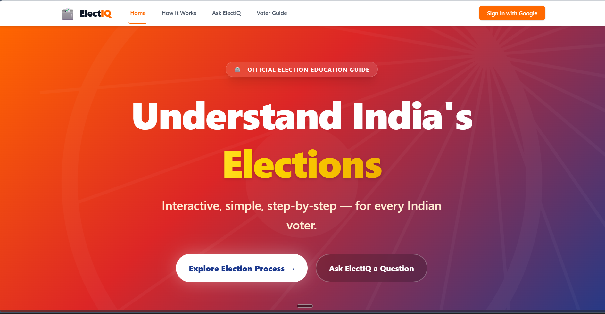
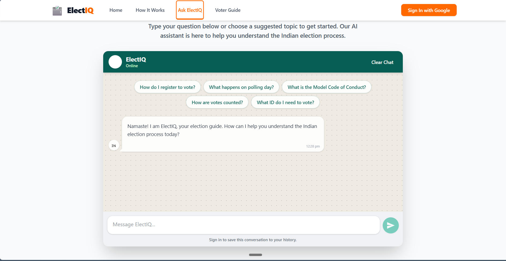

# 🗳️ ElectIQ — Indian Election Guide

An interactive, AI-powered election education platform designed to help Indian citizens understand the democratic process, from announcement to polling day.

Built for the **PromptWars Virtual Credit** challenge.

## 🌟 Features

*   **🗺️ Interactive Election Timeline:** A step-by-step visual guide detailing the 7 critical phases of an Indian election, explaining everything from the Model Code of Conduct to counting day.
*   **🤖 AI Election Assistant (ElectIQ):** A smart, conversational chatbot powered by Google Gemini (with Groq fallback) that answers your questions about voting, registration, and electoral rights in simple, jargon-free language.
*   **✅ Voter Readiness Checklist:** An interactive, persistent checklist to ensure you're fully prepared for election day, complete with direct links to official Election Commission of India (ECI) resources.
*   **📄 Important Documents Guide:** A clear visual reference of the EPIC (Voter ID) and the 12 alternative government-approved documents accepted at polling booths.
*   **♿ Accessibility First:** Built with comprehensive WCAG compliance, including full keyboard navigation, screen reader support, focus management, and a "Skip to content" link.
*   **📱 Fully Responsive:** A mobile-first design leveraging Tailwind CSS to ensure a beautiful experience on any device.

## 🛠️ Tech Stack

*   **Frontend Library:** React 18
*   **Build Tool:** Vite
*   **Styling:** Tailwind CSS v4
*   **Routing:** React Router v7
*   **AI Integration:** Google Gemini API (via `@google/genai`), Groq API fallback
*   **Backend & Auth:** Firebase (Firestore, Authentication, Hosting)
*   **Testing:** Vitest, React Testing Library

## 🚀 Setup Instructions

Follow these steps to run the ElectIQ platform locally.

### 1. Prerequisites
*   Node.js (v18 or higher recommended)
*   npm or yarn

### 2. Installation
Clone the repository and install the dependencies:
```bash
git clone https://github.com/yourusername/electiq.git
cd electiq
npm install
```

### 3. Environment Variables
Create a `.env` file in the root directory and add your API keys and Firebase configuration:

```env
# AI Providers
VITE_GEMINI_API_KEY=your_gemini_api_key
VITE_GROQ_API_KEY=your_groq_api_key

# Firebase Configuration
VITE_FIREBASE_API_KEY=your_firebase_api_key
VITE_FIREBASE_AUTH_DOMAIN=your_project.firebaseapp.com
VITE_FIREBASE_PROJECT_ID=your_project_id
VITE_FIREBASE_STORAGE_BUCKET=your_project.appspot.com
VITE_FIREBASE_MESSAGING_SENDER_ID=your_sender_id
VITE_FIREBASE_APP_ID=your_app_id
```

### 4. Running the Development Server
Start the Vite development server:
```bash
npm run dev
```
Navigate to `http://localhost:5173` in your browser.

### 5. Running Tests
Execute the Vitest test suite:
```bash
npm run test
```

## 📦 Deployment Instructions

This project is configured for easy deployment via Firebase Hosting or Vercel.

To build the production bundle:
```bash
npm run build
```

To deploy to Firebase (assuming you have the Firebase CLI installed and are logged in):
```bash
firebase deploy --only hosting
```

## 📸 Screenshots

*   **Home Page:** 
    
*   **Chat Assistant:** 
    
*   **Voter Guide:** 
    

---
*Disclaimer: ElectIQ is an educational tool. For official election information, always refer to the [Election Commission of India website](https://eci.gov.in).*
